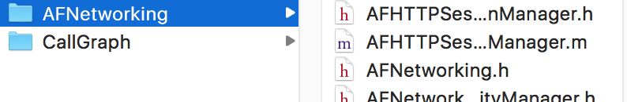
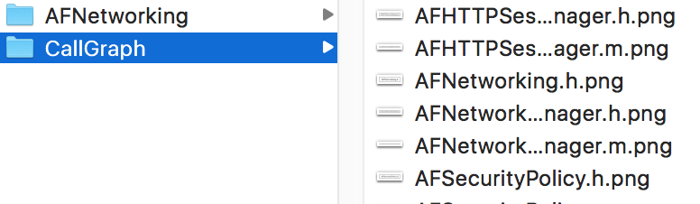
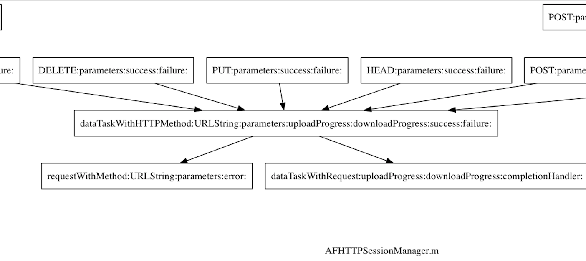

# clang-mapper
`clang-mapper` is a standalone tool build for automatic generate [Call Graph](https://en.wikipedia.org/wiki/Call_graph) in iOS project  

**[中文版](http://www.jianshu.com/p/e19aafbaddca)**

## Compile the source code
You can just use the pre-compiled binary file in the `relaese` folder (Build with Clang5.0.0). Or you can compile the source code in `clang-mapper` folder by yourself  

Follow the guide in [Tutorial for building tools using LibTooling and LibASTMatchers](https://clang.llvm.org/docs/LibASTMatchersTutorial.html). 
1. Download the `LLVM` and `Clang` source code, then copy the folder `clang-mapper` to `llvm/tools/clang/tools/`. 
2. Edit the file `llvm/tools/clang/tools/CMakeLists.txt` and add `add_clang_subdirectory(clang-mapper)` to the end.
3. Then build it with cmake and you will get a binary file `clang-mapper` in the `bin` folder, now copy it to `/usr/local/bin/`

## How to use
Before you use `clang-mapper`, make sure you have installed `Graphviz`.  

### Generate Call Graph
`clang-mapper` accept an arbitrary number of file or folder arguments, then it wil automatically deal with all code files and generate Call Graph in current path.  

For example, i make a folder *CallGraph* in the same path as *AFNetworking*
```
$ mkdir CallGraph
```

Then run command in *CallGraph* folder
```
$ cd CallGraph
$ clang-mapper ../AFNetworking --
```
The `clang-mapper` will traverse the *../AFNetworking* folder and generate all Call Graph in *CallGraph* folder



### Optional Command line Option
- **-graph-only** : Only generate *.png* files, this is a default option
- **-dot-only** : Only generate *.dot* files
- **-dot-graph** : Generate both *.png* and *.dot* files
- **-ignore-header** : Ignore *.h* file in the given folder

